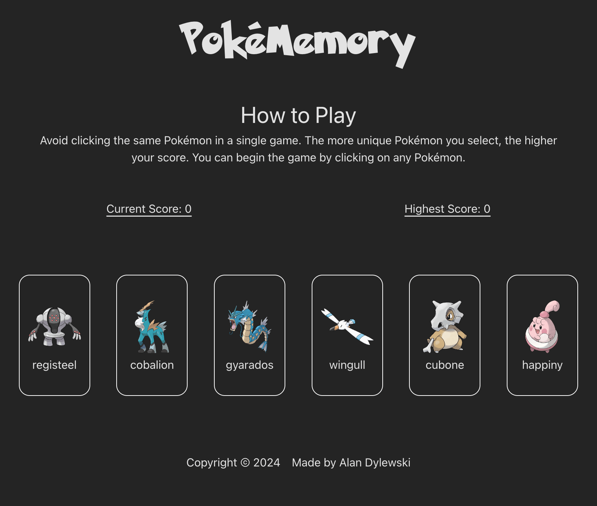
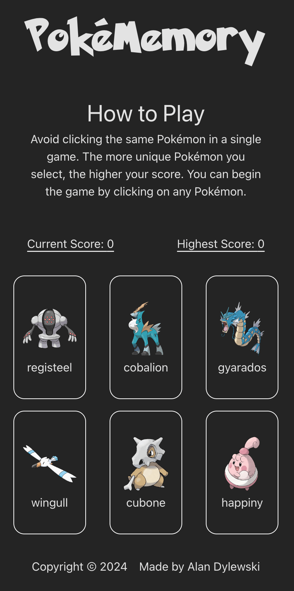

# PokeMemory

Welcome to PokeMemory. A memory game inspired by the beloved Pokémon universe.

## Game Overview

PokeMemory challenges players to remember and select unique Pokémon without repeating their choices. With each correct selection, a new Pokémon appears, increasing the difficulty. How many can you remember before making a mistake?

## Features

- **Dynamic Pokémon Grid**: A grid of Pokémon cards that dynamically updates with each new selection.
- **Score Tracking**: Keep track of your current and highest scores during your memory challenge.
- **Responsive Design**: Enjoy the game on any device, thanks to a mobile-first, responsive layout.

## Final Outcome:




## Technologies/Tools Used

- React
- CSS Modules for styling
- The [PokeAPI](https://pokeapi.co) for fetching Pokémon data

## Future Improvements:

- Implement various difficulty levels.

## Credits:

- Pokémon and Pokémon character names/images are trademarks of Nintendo.

## Getting Started

To get a local copy up and running, follow these simple steps.

### Prerequisites

Ensure you have [Node.js](https://nodejs.org/) installed on your machine.

### Installation

1. Clone the repo
   ```sh
   git clone https://github.com/your_username_/PokeMemory.git
   ```
